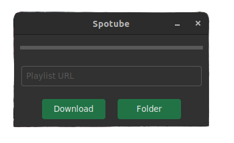
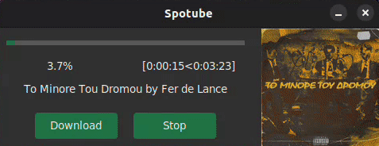

# Spotube

Spotube is a Python application that allows the user to download local `.mp3` copies of Spotify playlists, including cover art, artist information and lyrics.

## Description

The application can be used either as a [UI based application](#ui-version) or as a [command line tool](#cli-version).
In either case, the general principles of the application remain the same:\
The user provides the link to a public spotify playlist, and, optionally the directory to save the downloaded songs.
The application will then:

- Query the Spotify API for information on each song in the playlist, including the official name, artists, album cover art etc.
- Using the song name and artist(s), search for, and select the most relevant song video on Youtube. If possible, the application will avoid remixes, covers and video clip versions.
- Using the most relevant link, download the video in the highest possible quality, and convert to .mp3 format.
- Query the LyricsGenius API to retrieve the song lyrics, if available.
- Edit the .mp3 tags of the downloaded song to set the artist and album information, add the lyrics and set the cover art.

## Installation

To set up the application, follow these steps:

- Download the project files
- Install the required Python dependencies by running:
  ```
  pip install -r requirements.txt
  ```
- Install ffmpeg: This step differs based on your operating system:
  - For Windows systems, the ffmpeg executable is included in the project files. When first launching the app the executable will be extracted to the project`s root directory.
  - Unix users will need to install ffmpeg through the console. For example, in Ubuntu run:
  ```
  sudo apt-get install ffmpeg
  ```
  Attempting to run the app without having ffmpeg installed will result in an informative message with installation instructions.

## UI Version

To run the UI version of Spotube:

```
python3 spotube_ui.py
```

When first starting the app, the user might be asked to perform a first time installation. For more information see the [Installation](#installation) section.

\
_The initial state of the UI_

### UI Guide

To download a spotify playlist:

- Enter the link in the input field labeled `Playlist URL`.
- Click `Folder` and using the menu, select the location where the songs will be stored. \
  (This step is optional. If no folder is selected, the songs will be saved in a new folder named `Songs` in the current directory.)
- Click `Download`.

The UI will be updated to display the cover art of the current song, it`s title, the elapsed time and the estimated time until the download is complete.
The progress bar will fill up accordingly.

\
_Dynamic UI updates_

## CLI Version

To run the CLI version of Spotube:

```
python3 spotube_cli.py [URL] (Optional)[DIRECTORY]
```

Where:

- {URL}: The address of the Spotify playlist to download.
- {DIRECTORY}: The directory to store the songs. If empty, `./Songs` will be used by default.

Similarly to the UI version, the app will check if ffmpeg is installed. For more information see the [Installation](#installation) section.
Next, the system will validate the given arguments. If they are invalid, eg. the link is wrong, or the user does not have access to the specified directory, the app will exit.

If all arguments are validated, the download will start.
Two progress bars will appear:

- The first bar tracks the overall progress of downloading the playlist.
- The second progress tracks of downloading the specific song, displaying it`s name and the current operation being performed.

## Disclaimer

Spotube is aimed strictly at personal use, as per the YouTube, Spotify and LyricsGenius license agreements. Sharing the
content collected by using this application, or using it for profit is strictly prohibited.
