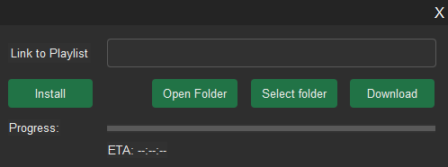

# Spotube
A simple Python app to download song audio based on a Spotify playlist

## Description
Spotube enables the creation of local copies of Spotify playlists, complete will cover art, artist information and 
lyrics, though an easy-to-use interface. The user provides the playlist list through the UI, and the application will 
gather information on each song, find the most appropriate version of the song on YouTube, download the mp3 version and 
combine it with the cover art, artist information and lyrics, if they are available on LyricsGenius.

## The UI
When first launching the program, the user will be asked to perform a first time installation. This involves unpacking 
the archive that contains the ffmpeg executable, that is used for file conversions. After this step, simply provide 
the URL of a public Spotify playlist and press download. The user can also choose a the directory where new songs will
be stored in by selecting the `Select Folder` button.

After the download has started, the program will calculate the estimated time of completion, given how long it took to
download the average song and how many songs remain. The progress bar will fill accordingly

## Disclaimer
Spotube is aimed strictly at personal use, as per the YouTube, Spotify and LyricsGenius license agreements. Sharing the 
content collected by using this application, or using it for profit is strictly prohibited.
